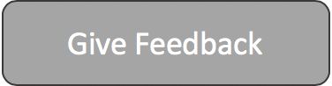

# Welcome to Dev Labs, let's get started!

This is a set of developer oriented labs built for one of the AWS summit events. If you're doing these at a summit then free lab accounts will be provided for you. If you are running these labs in your own aws accounts then you will incur charges for the resources provisioned for the labs.

Each lab takes approximately 15 minutes.

> Disclaimer: These labs are meant for learning purposes only, they are not meant to be used in production in any way shape or form.

## Instructions

* Select a lab to work through
* Click on "Lab Instructions"
* Click on "Go to Console"
* Follow instructions of specific lab to walk through it
* Fill in "Give Feedback" to get a small gift from us
* Enjoy!

## Select a lab from below to begin

### **1) Building and Debugging Lambdas with Cloud9**

Build a simple Lambda Function that sits behind an API gateway endpoint, learn how to use the Cloud9 IDE to Build, Debug and Deploy this Function.

### **2) Automate static website deployments to S3 using CodePipeline**

This lab walks you through the steps to host and deploy static websites to S3 using CodePipeline.

### **3) Build serverless data pipeline to process unstructured data (text) in your data lake**

In this lab, we will see how to process unstructured data using serverless options. We will be deploying a data pipeline that will perform sentiment analysis on text data. After the pipeline is completed, you can run SQL to get summary of sentiments score.

### **4) Build a live streaming application with Amazon Interactive Video Service**

This lab will walk you through how you can build a live streaming mobile application to create an interactive video experience.

<a href=""> <!--to update this -->

</a>

### **5) Bring your containerized web application online with Docker, AWS App Runner and Amazon Elastic Container Registry**

In this lab we will learn how to build a containerized web application, publish the container image to Amazon Elastic Container Registry, and use AWS App Runner to pull the image from the registry to host the application on AWS Cloud.

### **6) Update IAM Password Policy Programmatically**

This lab walks you through the steps you need to take to automatically set the IAM Password Policy for all AWS IAM users according to AWS Foundational Security Best Practices standard. It also describes how you can govern the IAM Password Policy across all linked accounts.

### **7) AWS Amplify React 101**

Creating a React App hosted on Amplify that takes advantage of the seamless integration with Material UI to quickly build UI components. The workshop covers creation of components like tables, buttons etc. as well as style modules to manipulate the look of the UI features.

### **8) Build a visual search engine using AWS AI ML services**

Sometimes it’s hard to find the right words to describe what you’re looking for. As the adage goes, “A picture is worth a thousand words.” Often, it’s easier to show a physical example or image than to try to describe an item with words, especially when using a search engine to find what you’re looking for. 

In this lab, you build a visual image search application from scratch in under 15 min, including a full-stack web application for serving the visual search results.

### **9) Run Chaos Engineering experiments on Amazon Elastic Container Service with AWS Fault Injection Simulator**

In this lab we will run chaos engineering experiments by injecting faults into Amazon ECS. We will observe how these experiments helps us to observe the resiliency of the application.

### **10) Using Amazon Macie to detect Sensitive Data in S3 buckets**

The lab will involve participants loading some sample data into an S3 bucket. And then enabling and running Macie on that specific bucket, and finally parsing through the results to view the outputs.

### **11) Quickly accelerate application performance using Amazon ElastiCache for Redis with AWS CDK**

The lab showcases Amazon Elasticache through a demo App that can be deployed using CDK.

### **12) Build a serverless application using AWS CDK for .NET**

Learn how to become a super efficient user of the aws cli

## Thanks for completing a lab, hope you had fun!

We really appreciate your feedback and would love to hear about what you loved and what we can improve.

#### Please give us feedback so we can improve these labs.
